# SOP — Standard Operating Procedures

# Description

The goal of the **Standard Operating Procedures (SOP) protocol** is to define a clear and consistent way to develop, run, and maintain all lab scripts.

Its purpose is to keep the workflows reproducible, organized, and easy to follow for everyone.

By following this framework, every lab member can:

- understand how to install, configure, and run scripts,
- contribute new code in a consistent and traceable way,
- and ensure that all analyses remain reproducible across systems and users.

This protocol helps to maintain the same standards across the lab while keeping the onboarding process smooth and the collaboration effortless.

# Outline

To achieve the goals of the **Standard Operating Procedures (SOP)**, the following core technologies are used:

- **Git** — version control system for tracking changes, maintaining a clean project history, and enabling safe collaboration.
- **GitHub** — collaborative development platform for sharing code, reviewing changes, managing issues, and organizing project workflows.
- **Anaconda** — environment management system that simplifies package installation and ensures reproducible setups across different operating systems.
- **Visual Studio Code (VSCode)** — code editor used as the primary development environment, offering integrated support for Git, Jupyter notebooks, and Python environments.
- **Spyder** — user-friendly code editor recommended for users who prefer a simpler interface for writing, debugging, and running Python scripts.

# Onboarding guide

This part of the SOP is intended to help new lab members set up their local development environment and get started with running lab scripts. It covers the installation and configuration of necessary tools, cloning repositories, setting up environments, and executing scripts.

In order to learn how to update and maintain the projects, please refer to the **[Maintenance guide](#maintenance-guide)** section.

## 0. Tools installation and configuration

First things first — we need to install all the required tools for the workflow.
If you already have a listed tool installed or an account created on the mentioned service, you can skip that step.

> ⚠️ Disclaimer: 
> 
> The following guide uses **the simplest and most user-friendly approaches**, allowing even complete beginners to set up and maintain projects with ease.
Most procedures can also be done through the **terminal** — if you’re comfortable using it, you’re very welcome to do so.


### 0.1. Install Python [[🔗 link]](https://www.python.org/downloads/)

> *Python* is the main programming language used in our lab workflows.

Download the latest Python 3.x installer (e.g., *Python 3.11*) for your operating system by the link above.

**During installation on Windows, make sure to check the box “Add Python to PATH.”**

- ***Verification:***
    
    Open terminal:
    
    **Windows** → press Win + R, type cmd, and press Enter.

    **macOS** → open *Launchpad → Terminal*.

    **Linux** → open *Applications → Terminal*.
    
    Then type:
    
    ```sql
    python --version
    ```
    
    or
    
    ```sql
    python3 --version
    ```
    
    You should see something like: `Python 3.11.7`. If that appears, Python is correctly installed 👍
    

### 0.2. Install Git [[🔗 link]](https://git-scm.com/install/)


> *Git* is a version control system that allows you to track changes in scripts and notebooks, collaborate with others without version conflicts, revert to stable versions, and maintain a clean project history.


Download and install Git from the official page linked above.


### 0.3. Create GitHub account [[🔗 link]](https://github.com/)

> *GitHub* is a cloud platform that stores all of our lab scripts. It allows to conveniently share projects’ code base/notebooks, observe these files and changes (done with Git) with a webpage, manage projects by creating and assigning tasks, and more.

Open the link above and create a free account.


### 0.4. Configure Git and GitHub

After installing Git and creating a GitHub account, we need to link them together.

Open Git Bash (Windows) or terminal (macOS/Linux) and run the following commands, replacing the placeholders with your actual information:

```bash
git config --global user.name "Your GitHub Username"
git config --global user.email "Your GitHub Email"
```

### Verification:
To verify that Git is correctly configured, run the following commands in Git Bash or terminal:

```bash
git config --global user.name
git config --global user.email
```

You should see your GitHub username and email printed in the terminal. If they appear correctly, Git is successfully linked to your GitHub account.


### 0.5. Install Anaconda [[🔗 link]](https://www.anaconda.com/download/success)

>The CLI program **conda** is both a package manager and an environment manager. This helps data scientists ensure that each version of each package has all the dependencies it requires and works correctly. **Anaconda Navigator** is a graphic user interface (GUI) for more user-friendly environment configuration and management.

On the download page, **choose the “Distribution Installers” option** and follow the installation instructions for your operating system.

### 0.6. Install Visual Studio Code [[🔗 link]](https://code.visualstudio.com/download)

> *Visual Studio Code (VSCode)* is a lightweight and highly customizable code editor (similar to Spyder) that is extremely versatile: we can perform development and running of the code and notebooks (ex. Jupyter notebook), manipulate environments, use built-in version control, and much more with clear user-friendly interface.

Download VSCode from the link above and install it following the on-screen instructions.

### 0.7. Configuration of VSCode: Extensions and Terminal

1. **Install required extensions ([documentation](https://code.visualstudio.com/docs/getstarted/extensions)):**
Open the tab “Extensions” in the sidebar.
    
    
    
    Find and install following extensions:
    ”Python”, “Jupyter”, “Jupyter Notebook Renderers”, “Better Comments”, “GitLens”, “Conda Wingman”, and “Material Icon Theme”.

    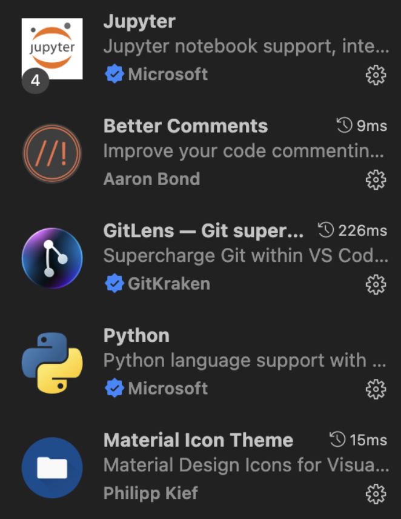

2. **Log in to your GitHub account ([documentation](https://code.visualstudio.com/docs/sourcecontrol/intro-to-git)):**
Click on the “Accounts” icon in the left bottom corner and log in to your GitHub account.
    
    
    
<!-- 3. (Windows only) **Set VSCode’s default terminal to Git Bash**:
Open the command palette (`Ctrl + Shift + P`) and type Terminal: Select Default Profile → choose **Git Bash**. -->


> Generally, the main tools that we will use in VSCode are:
>
> 1. *File Explorer*: tree view of all files and folders in the opened project/repository
> 2. *Source Control*: interface for managing Git repositories
> 3. *Extensions*: additional features and functionalities for VSCode
> 4. *Terminal*: command-line interface for executing commands

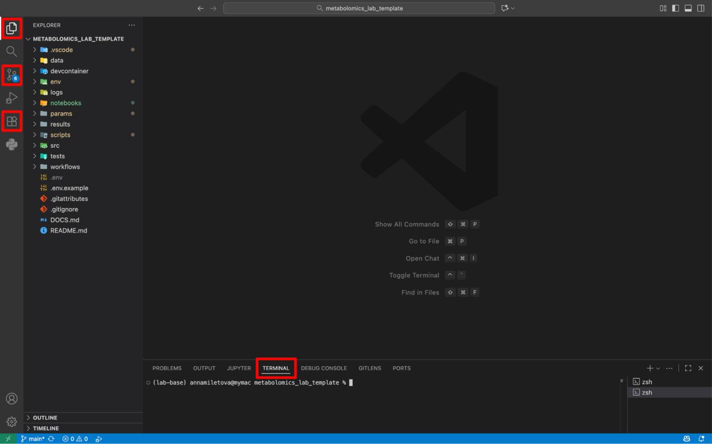

You can optionally check a more detailed  guide from official documentation of the VSCode: [Tutorial: Get started with Visual Studio Code](https://code.visualstudio.com/docs/getstarted/getting-started)

## 1. Clone the repository

> *Repository* — is a “box” containing all the files related to our project (or logical part of a project). We need GitHub to store repositories online to easily share them between members. In order to get the repository on your computer you need to *clone* them from GitHub to your local machine. VSCode gives us an easy way to do so ⬇️

To clone a repository, select the **Clone Repository** button in the **Source Control** view, or run the **Git: Clone** command in the Command Palette (`Ctrl + Shift + P` / `⌘ + Shift + P`).


> **Note:** in the inbuilt search you will find public and private repositories that you have access to. If the needed repository doesn’t appear in the search results, probably you still don’t have permissions for it. **Request your mentor for the access to the repository.**
> 

Once cloned, open the folder in VSCode.

All repositories follow a shared structure described in the **[Repository Template section](#repository-template)** — please review it carefully.

## 2. Configure input

> *Environment variables* and *parameters* are settings that control how the scripts behave. They allow us to customize the execution without changing the actual code, making it easier to run the same script with different configurations.

### 2.1. Input data

Place all the needed input data files in the appropriate folder (`./data/`) as described in the **[Repository Template section](#repository-template)**.

### 2.2. `.env`

Open `.env.example` file in the root of the repository. It contains environment variables that are used across the scripts, usually **paths, API keys and experiment ID**. Create a copy of this file and rename it to `.env`. Fill in all the variables with appropriate values. Make sure that the paths are correct for your local machine.

### 2.3. `params.yml`

Open `params/000_default.yml` file. It contains experiment-specific parameters that are used across the scripts, usually names of the files and folders, settings for the analysis, etc. Check the parameters, if needed, create a copy of this file and rename it to `params/001_[your_experiment_name].yml`. Fill in all the variables with appropriate values.

>*Hypothetical example, if we have a normalization script that is using IS+median normalization by default (parameters in `params/000_default.yml`: `IS_normalization=true` and `median_normalization=true`) and we want to run it using only median normalization, we would change the value of the parameter `IS_normalization` from `true` to `false`, and call the new file `params/001_median_normalization.yml`.*

## 3. Setup the environment

> *Packages* are essential instruments that greatly extend the functionality of the scripts. NumPy, pandas, and matplotlib are the most commonly used packages that extend python script with an ability to analyze data, plot graphs, and perform complex computations with ease.
> 
> However, different projects may require different package versions, which can cause conflicts and errors.
> 
> To avoid this, we use an *environment* — an isolated workspace that allows us to install and manage specific package versions independently for each project, ensuring stability and reproducibility.
> 
> In the lab we use Anaconda as both, package manager and environment manager.

<!-- TODO: redo environment management with conda navigator, not with vscode extensions -->
<!-- Open `env/environment.yml` file. It stores all the needed packages and their versions.

Conda Wingman extension will display a button “Build Env from YAML.”


Click it to create the environment with all the required packages. -->

## 4. Run the code

As for now we are using Python scripts and Jupyter notebooks to perform needed operations.

### 4.1. Python script

Python extension finds all the available environments and displays them in the sidebar. Click `Python > Environment Managers > Conda > Named`. Click the Tick ("Set As Project Environment") next to the name of [just created environment](#2-setup-the-environment).

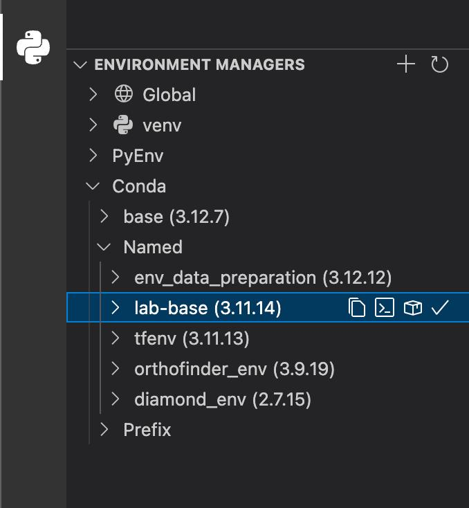

In order to run Python script open the file using VSCode Explorer — you will need either a single file from the `scripts/` folder or `src/[name]/main.py`

Click the "Play" button in the top-right corner to run the script. 

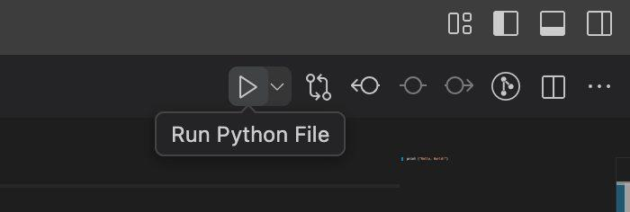

### 4.2. Jupyter Notebook

In order to run Jupyter Notebook open the needed .ipynb file using VSCode Explorer — it will be located in the `notebooks/` folder.

Click "Select Kernel" in the top right corner. 

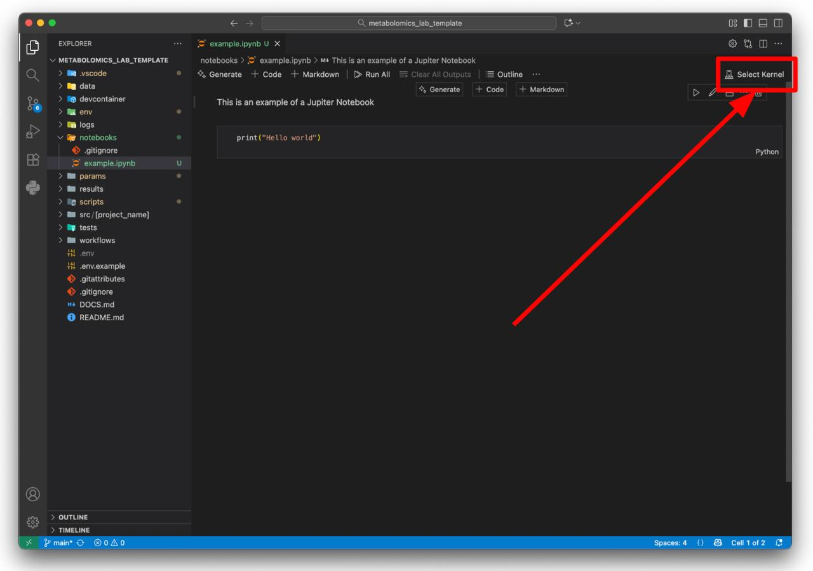

Choose "Python Environments..." and then the environment that you [just created](#2-setup-the-environment).

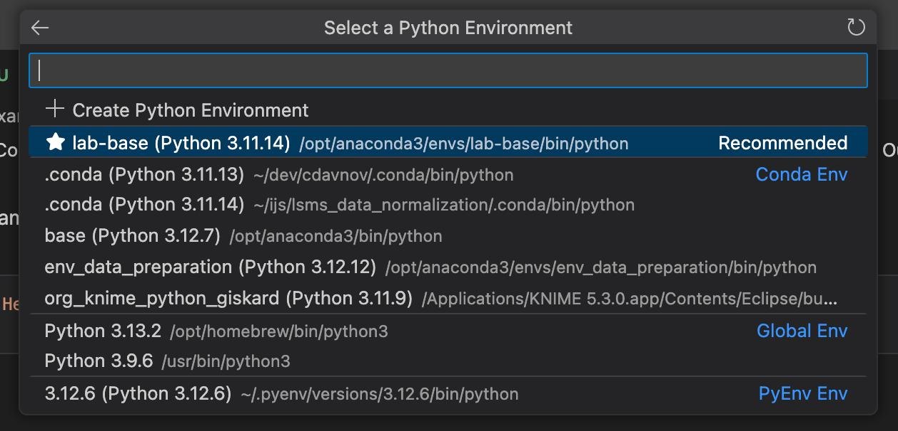

Now you can execute all the cells by clicking "Run All" all just one certain cell by clicking "Execute Cell" from the left of the cell.

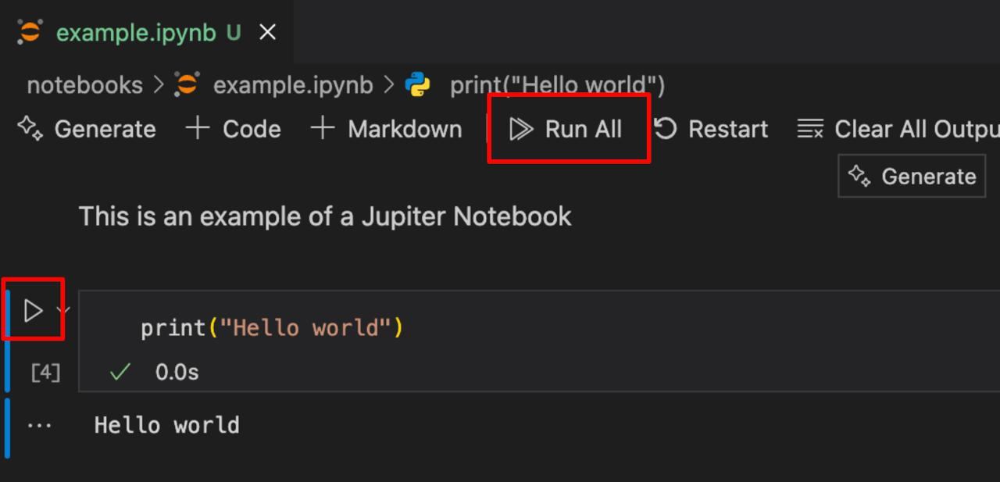

## 5. Troubleshooting

If you encounter any issues during the setup or execution of the scripts/notebooks, refer to the troubleshooting section below for common problems and their solutions.

### Python extension is not displayed in the sidebar *(common, temporary)*

<!-- TODO -->

### Git signup errors *(common)*

<!-- TODO -->

### Git Bash is not recognized *(Windows-specific)*

<!-- TODO -->

# Maintenance guide

This section is intended to help lab members update and maintain the projects following the established SOP protocols. It covers best practices for code updates, environment management, version control, and collaboration.

## 1. Working with code

When working with the codebase, it is essential to follow best practices to ensure that changes are made safely and effectively. This includes writing clear and concise code, following established coding standards, and thoroughly testing changes before deploying them. In process of work you may need to add new files or folders to the repository. We have a **[naming conventions](#naming-conventions)** and **[repository structure](#repository-template)** that should be always followed for consistency across the lab. Be sure to review and understand these guidelines before making any modifications.


> ‼️ **Before you start, don't forget to**:
>
> - **Pull** the latest changes from the remote repository before starting your work to ensure you are working with the most up-to-date codebase.
> - Create a **new branch** for your changes to isolate them from the main codebase.
> - **Activate** the correct **environment** for the project you are working on to ensure compatibility with the codebase.

## 2. Updating the environment

When new packages are added to the project or existing ones need to be updated, follow these steps to ensure the environment remains consistent and functional.

1. **Add or update packages** using Python Extension:
    Open the sidebar, navigate to `Python > Environment Managers > Conda > Named`. Click the pencil icon next to the environment name to open the environment management interface.

    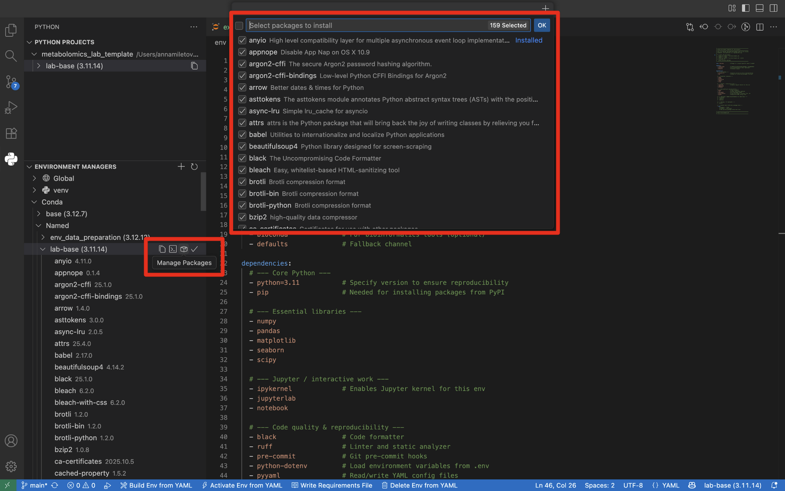

2. **Rewrite the environment**:
    After making changes to the environment, it is crucial to update the `env/environment.yml` file to reflect these changes. This ensures that anyone cloning the repository in the future can recreate the exact environment needed for the project.

    Open the `environment.yml` file and click `Write Requirements File` at the status bar in the bottom of the window. This will overwrite the existing file with the current state of the environment. 
    > **Note**: ensure that the path to the `environment.yml` file is correct in the command settings, it should point to `env/environment.yml`

## 3. Saving your changes

When you make changes to the codebase, it is crucial to follow proper version control practices to ensure that all modifications are tracked and can be reverted if necessary.

Be sure to create a new branch for your changes, commit them with clear and descriptive messages, and push them to the remote repository on GitHub.

> If you don't know how to use Git, please refer to the **["How does Git work?"](#how-does-git-work)** section and then proceed with further instructions.

## 3.1. Note about working with notebooks

> ⚠️ **Do not edit Jupyter notebooks manually!**
>
> When working with Jupyter notebooks, it is important to keep in mind that the notebook files (`.ipynb`) are structured as JSON. This means that when you make changes to a notebook, you should **avoid making manual edits to the JSON structure** *unless you are familiar with it*. Instead, **use the VSCode Jupyter Extension** (or Jupyter interface) to make changes, as this will ensure that the notebook remains valid and functional. How to run Jupyter notebooks is described in the **[3.2. Jupyter Notebook](#32-jupyter-notebook)** section.

> 🧹 **Clear output cells before committing**
>
> To keep the notebook files clean and avoid unnecessary merge conflicts, it is recommended to **clear the output cells** before committing changes to the repository. This can be done using the "Clear All Outputs" option in the VSCode Jupyter Extension.
>
> Moreover, it is a good practice to **restart the kernel and run all cells in the notebook** to **ensure** that everything works as expected before saving and committing your changes.

> 🛠️ **Render notebooks**
>
> For better visual representation of the notebook changes on GitHub (and other platforms), sometimes it can be needed to **render** the notebooks before committing (especially **before publication**). You can use the **Jupyter Notebook Renderers** extension in VSCode (that was already installed in the **[Configuration of VSCode Extensions](#06-configuration-of-vscode-terminal-and-extensions)** section) to achieve this.
> 
> This will generate a static HTML/PDF version of the notebook, which can be easily viewed in browsers/viewers without the need for a Jupyter environment.
>
> To render the notebook, open it in VSCode and click on the "Export" button provided by the extension. Save the rendered file in the `results/reports/` folder with an appropriate name indicating the notebook's purpose and version.

# Project creation guide

To do...
 
# Additional

## How does Git work?

Git is a version control system that tracks changes to files over time, allowing multiple people to collaborate on a project without overwriting each other's work. It enables you to create branches for new features or bug fixes, merge changes back into the main codebase, and revert to previous versions if needed.

### Git Workflow

Down below is a quite good simplified illustration of how Git works:

> 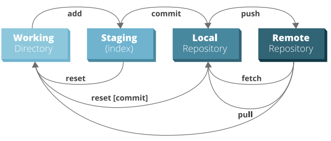
>
> *Working Directory* — the files and folders you see on your computer.
>
> *Staging Area (index)* — a temporary virtual area (still on your computer) where you prepare changes before committing them to the repository.
>
> *Local Repository* — a hidden folder on your computer that stores all the versions of your project (i.e. commits).
>
> *Remote Repository* — a version of your project hosted on a server (e.g., GitHub) that allows collaboration with others.

The typical Git workflow involves the following steps:

0. **Pull changes**.
    
    Before starting your work *always* check if there any updates in the remote repository. Open Source Control tab in VSCode and click on the `... > Pull` to fetch and merge changes from the remote repository into your local working directory.

    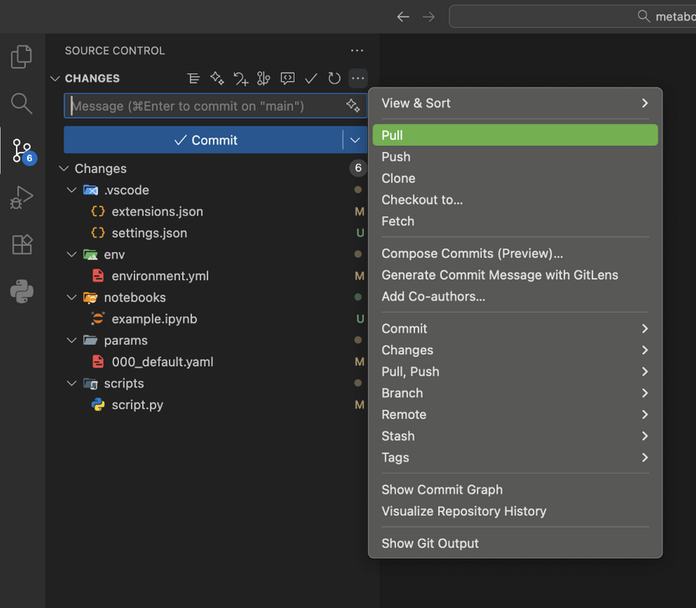

1. **Make changes**.

    Modify files in your working directory.

    > In case you are working on a **new feature or bug fix**, it is recommended to create a *new branch* to isolate your changes from the main codebase. This allows easier collaboration and code review. Branching feature is in details described in the **[Branching and Merging](#branching-and-merging)** section.

2. **Stage changes**.

    Add the files you want to include in your next commit to the staging area using `+` ("Stage Changes") button in VSCode Source Control tab. You can add single files, whole folders or all changes at once.

    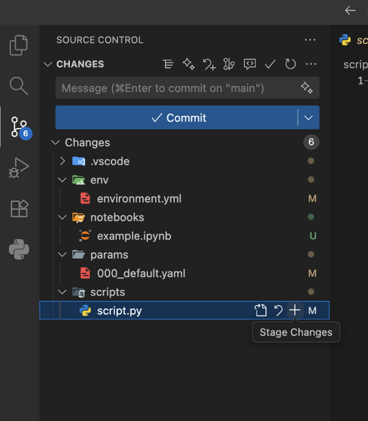

3. **Commit changes**.

    > *Commit* — a snapshot of your project at a specific point in time.

    Write a descriptive commit message in the input box at the top of the Source Control tab and click the button to create a new commit.

    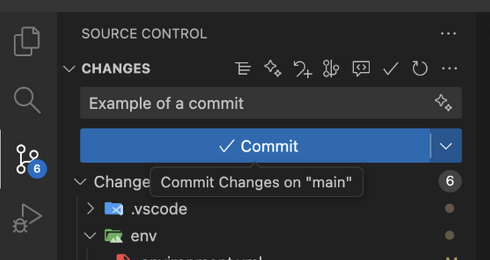

    > ✅ **Best Practices for Commits**:
    >
    > - Keep it *concise yet descriptive*. A good commit message should summarize the changes made.
    > - Include a *detailed description if necessary*, explaining the "why" behind the changes.
    > - *Review* your changes before committing to ensure accuracy.
    > - Avoid committing *large binary files or generated files* (**always** keep them in `.gitignore`).
    > - Commit *related changes together* to maintain a clear project history.
    > - Commit *frequently* to capture incremental progress and make it easier to track changes. Yet preserve logical units of work.


4. **Push changes**.

    Now when you have your changes committed locally, it’s time to upload them to the remote repository on GitHub.

    Use the `... > Push` button in VSCode Source Control tab to upload your local commits to the remote repository on GitHub.

    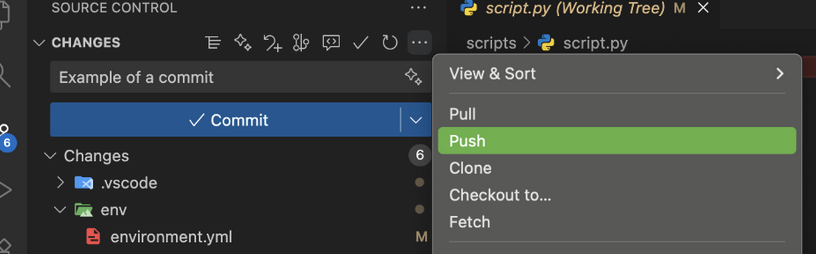

### Branching and Merging

When working on new features or bug fixes, it is recommended to create a new branch to isolate your changes from the main codebase. This allows easier collaboration and code review.

Branching feature allows multiple developers to work on different features or fixes simultaneously without interfering with each other's work.

1. **Create a new branch**.

    To create a new branch in VSCode, open Source Control tab and click `... > Branch > Create Branch...`. Enter a descriptive name for your branch (e.g., `feature/new-feature` or `bugfix/issue-123`).

    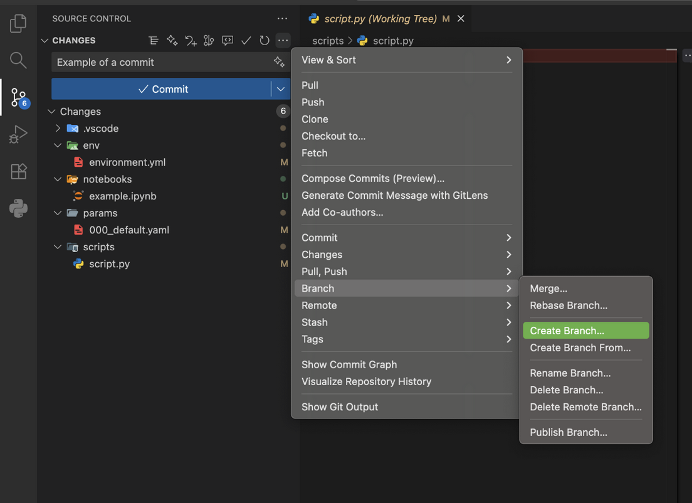

    If you have an assigned task in GitHub Issues or Projects, it is a good practice to include the issue number in the branch name for better traceability. You can also *create branches directly from GitHub interface when working with Issues or Projects*. Then be sure to pull the newly created branch to your local repository.

    After creating the branch, VSCode will automatically switch to it. You can verify the current branch by checking the bottom-left corner of the VSCode window.

    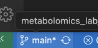

2. **Make changes, stage, commit, and push**.

    Follow the same steps as described in the main Git workflow: make changes, stage them, commit with a descriptive message, and push to the remote repository.

3. **Merge changes back to the main branch**.

    Once your feature or bug fix is complete and tested, you can merge your changes back into the main branch (usually `main` or `master`).

    First, switch to the main branch using `... > Branch > Checkout to...` in VSCode Source Control.

    Then, use `... > Branch > Merge Branch...` to merge your feature branch into the main branch.

    Finally, push the updated main branch to the remote repository using `... > Push`.

### A bit more about Git workflow

Broader Git workflow is illustrated below:

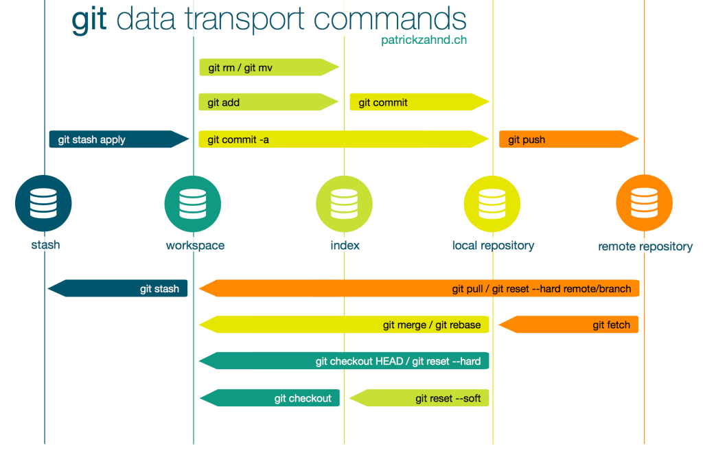

Possibilities of Git are way broader and can be useful for various workflows and collaboration strategies. For more information, please refer to the official Git documentation: [Git - Documentation](https://git-scm.com/doc)

## Repository Template

In order to keep collaborativeness, mainetanance, scalability simple and clear, it is crucial to preserve consistency within the structure of the repositories.

Template of the repository structure can be found [here](https://github.com/miletovaa/metabolomics_lab_template).

Always **start new project by using this template** as a base and **follow** the established structure when **adding** new files or folders to existing repositories.

## Naming Conventions

- Use in output directory id of the experiment param.yaml you used