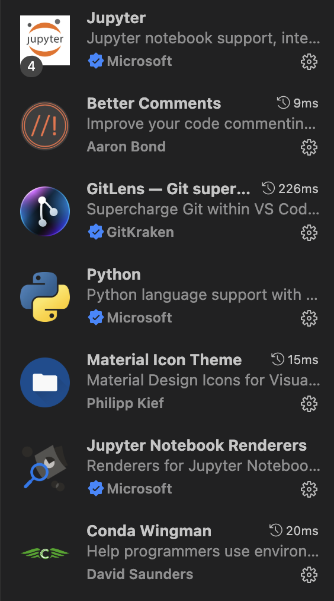
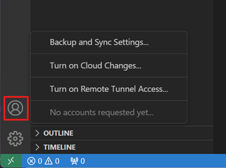
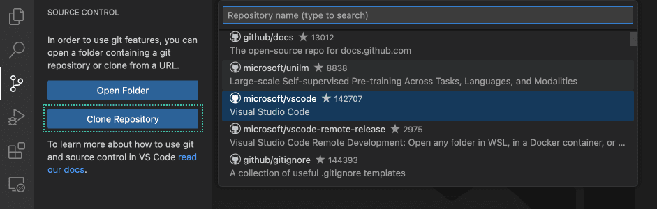
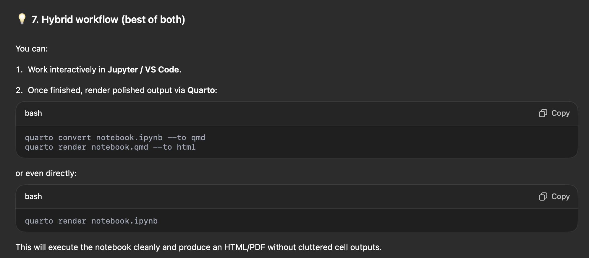

# SOP — Standard Operating Procedures

# Description

The goal of the **Standard Operating Procedures (SOP) protocol** is to define a clear and consistent way to develop, run, and maintain all lab scripts.

Its purpose is to keep the workflows reproducible, organized, and easy to follow for everyone.

By following this framework, every lab member can:

- understand how to install, configure, and run scripts,
- contribute new code in a consistent and traceable way,
- and ensure that all analyses remain reproducible across systems and users.

This protocol helps to maintain the same standards across the lab while keeping the onboarding process smooth and the collaboration effortless.

# Outline

To achieve the goals of the **Standard Operating Procedures (SOP)**, the following core technologies are used:

- **Git** — version control system for tracking changes, maintaining a clean project history, and enabling safe collaboration.
- **GitHub** — collaborative development platform for sharing code, reviewing changes, managing issues, and organizing project workflows.
- **Anaconda** — environment management system that simplifies package installation and ensures reproducible setups across different operating systems.
- **Visual Studio Code (VSCode)** — code editor used as the primary development environment, offering integrated support for Git, Jupyter notebooks, and Python environments.
- **Spyder** — user-friendly code editor recommended for users who prefer a simpler interface for writing, debugging, and running Python scripts.

# Onboarding guide

## 0. Tools installation and configuration

First things first — we need to install all the required tools for the workflow.
If you already have a listed tool installed or an account created on the mentioned service, you can skip that step.

> ⚠️ Disclaimer: 
> 
> The following guide uses **the simplest and most user-friendly approaches**, allowing even complete beginners to set up and maintain projects with ease.
Most procedures can also be done through the **terminal** — if you’re comfortable using it, you’re very welcome to do so.


### 0.1. Install Python [[🔗 link]](https://www.python.org/downloads/)

> *Python* is the main programming language used in our lab workflows.

Download the latest Python 3.x installer (e.g., *Python 3.11*) for your operating system by the link above.

**During installation on Windows, make sure to check the box “Add Python to PATH.”**

- ***Verification:***
    
    Open terminal:
    
    **Windows** → press Win + R, type cmd, and press Enter.

    **macOS** → open *Launchpad → Terminal*.

    **Linux** → open *Applications → Terminal*.
    
    Then type:
    
    ```sql
    python --version
    ```
    
    or
    
    ```sql
    python3 --version
    ```
    
    You should see something like: `Python 3.11.7`. If that appears, Python is correctly installed 👍
    

### 0.2. Install Git [[🔗 link]](https://git-scm.com/install/)


> *Git* is a version control system that allows you to track changes in scripts and notebooks, collaborate with others without version conflicts, revert to stable versions, and maintain a clean project history.


Download and install Git from the official page linked above.

### 0.3. Create GitHub account [[🔗 link]](https://github.com/)

> *GitHub* is a cloud platform that stores all of our lab scripts. It allows to conveniently share projects’ code base/notebooks, observe these files and changes (done with Git) with a webpage, manage projects by creating and assigning tasks, and more.

Open the link above and create a free account.

### 0.4. Install Anaconda [[🔗 link]](https://www.anaconda.com/download/success)

>The CLI program **conda** is both a package manager and an environment manager. This helps data scientists ensure that each version of each package has all the dependencies it requires and works correctly. **Anaconda Navigator** is a graphic user interface (GUI) for more user-friendly environment configuration and management.

On the download page, **choose the “Distribution Installers” option** and follow the installation instructions for your operating system.

### 0.5. Install Visual Studio Code [[🔗 link]](https://code.visualstudio.com/download)

> *Visual Studio Code (VSCode)* is a lightweight and highly customizable code editor (similar to Spyder) that is extremely versatile: we can perform development and running of the code and notebooks (ex. Jupiter notebook), manipulate environments, use built-in version control, and much more with clear user-friendly interface.

Download VSCode from the link above and install it following the on-screen instructions.

### 0.6. Configuration of VSCode: Terminal and Extensions

1. **Install required extensions ([documentation](https://code.visualstudio.com/docs/getstarted/extensions)):**
Open the tab “Extensions” in the sidebar.
    
    
    
    Find and install following extensions:
    ”Python”, “Jupyter”, “Jupyter Notebook Renderers”, “Better Comments”, “GitLens”, “Conda Wingman”, and “Material Icon Theme”.
    
    
    
2. **Log in to your GitHub account ([documentation](https://code.visualstudio.com/docs/sourcecontrol/intro-to-git)):**
Click on the “Accounts” icon in the left bottom corner and log in to your GitHub account.
    
    
    
3. (Windows only) **Set VSCode’s default terminal to Git Bash**:
Open the command palette (`Ctrl + Shift + P`) and type Terminal: Select Default Profile → choose **Git Bash**.


> Generally, the main tools that we will use in VSCode are:
>
> 1. *File Explorer*
> 2. *Source Control*
> 3. *Extensions*
> 4. *Terminal*

You can optionally check a more detailed “Getting started” guide from official documentation of the VSCode: [https://code.visualstudio.com/docs/getstarted/getting-started](https://code.visualstudio.com/docs/getstarted/getting-started)

## 1. Clone the repository

> *Repository* — is a “box” containing all files related to our project (or logical part of a project). We need GitHub to store repositories online to easily share them between members. In order to get the repository on your computer you need to *clone* them from GitHub to your local machine. VSCode gives us an easy way to do so ⬇️

To clone a repository, run the **Git: Clone** command in the Command Palette (`Ctrl + Shift + P` / `⌘ + Shift + P`), or select the **Clone Repository** button in the **Source Control** view.



> **Note:** in the inbuilt search you will find public and private repositories that you have access to. If the needed repository doesn’t appear in the search results, probably you still don’t have permissions for it. **Ask your mentor for the access to the repository.**
> 

All repositories have the same structure. More details about it can be found in the additional **[Repository Template](#repository-template)** section (***and it is highly important to be familiar with it and follow it)***.

## 2. Setup the environment

> *Packages* are essential instruments that greatly extend the functionality of the scripts. NumPy, pandas, and matplotlib are the most commonly used packages that extend python script with an ability to analyze data, plot graphs, and perform complex computations with ease.
> 
> However, different projects may require different package versions, which can cause conflicts and errors.
> 
> To avoid this, we use an *environment* — an isolated workspace that lets us install and manage specific package versions independently for each project, ensuring stability and reproducibility.
> 
> In the lab we use Anaconda as both, package manager and environment manager.

Open `env/environment.yml` file. It stores all the needed packages and their versions.

Conda Wingman extension dynamically adds status bar items for quick Conda command access when a YAML file is open, simplifying Conda environment management.


Click “Build Env from YAML” and then “Activate Env from YAML”. This will create and run the workspace with all the required packages for the code reproduction.

## 3. Run the script

## 3.1. Python script

To do...

## 3.2. Jupiter Notebook

To do...

# Maintenance guide

To do...

When working with notebooks:



# Project creation guide

To do...

# Additional

## How does Git work?

To do…

## Repository Template

In order to keep collaborativeness, mainetanance, scalability simple and clear, it is crucial to preserve consistency within the structure of the repositories.

## Naming Conventions

- Use in output directory id of the experiment param.yaml you used